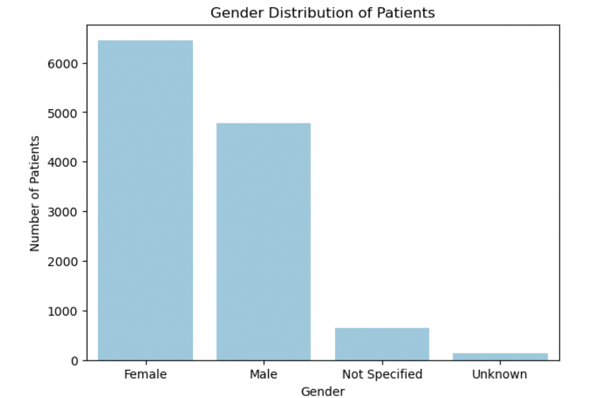
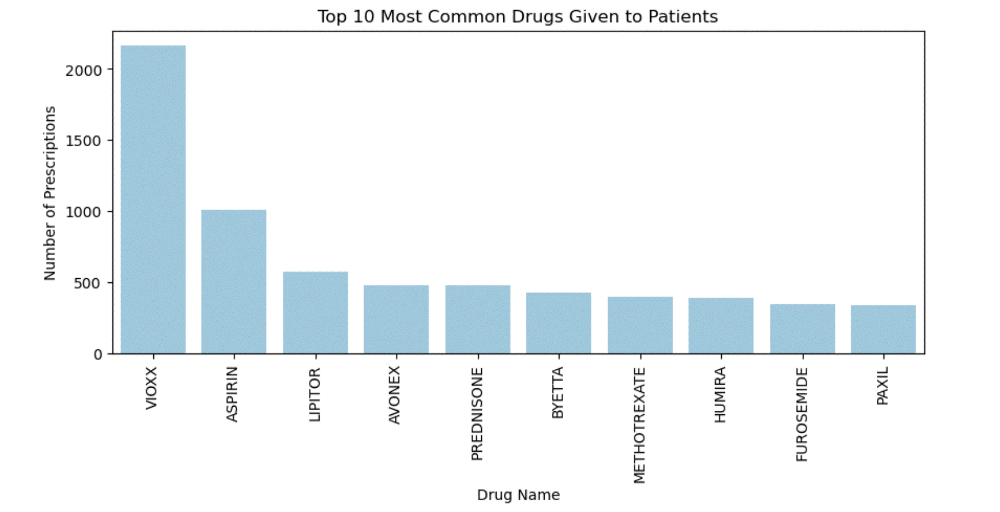
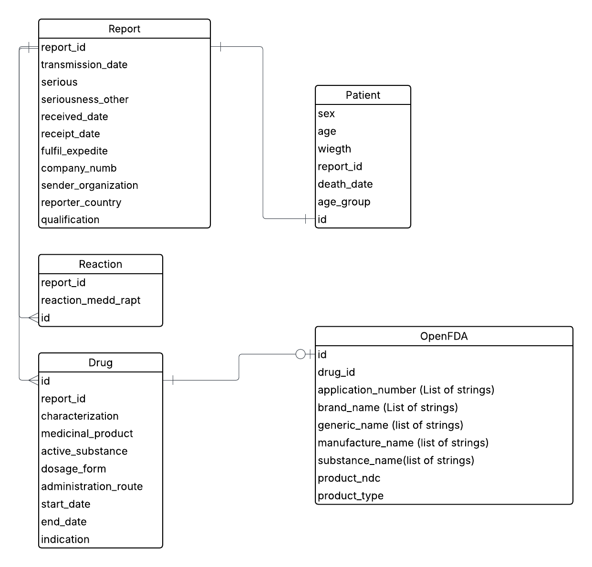

# Data Engineering Bootcamp Capstone: Data Exploration

## Project Overview
This project uses the **openFDA Adverse Event Reporting System (AERS)** dataset, specifically the **drug adverse event reports**.  
The goal of Step 4 is to **clean, explore, and model the dataset** so that it is ready for downstream consumption by data analysts, data scientists, or other engineering pipelines.

Dataset Source: [openFDA Drug Adverse Events](https://open.fda.gov/apis/drug/event/)

---

## Objectives
- Explore the dataset to understand structure, quality, and distribution.  
- Identify missing values, constant fields, and heterogeneity across columns.  
- Extract and normalize nested JSON fields (e.g., `patient.drug`, `patient.reaction`).  
- Provide a data model (ERD) to reduce redundancy and optimize storage/querying.  
- Define cleaning and wrangling steps needed before transformation.  

---

## Data Exploration Summary

### 1. Column Homogeneity
- Each column was checked for **data type consistency**.  
- Results show some columns are **homogeneous** (all strings/ints), while others contain **mixed types** due to JSON parsing or inconsistent reporting.

Example output:
- `safetyreportid`: homogeneous → string  
- `receiptdate`: homogeneous → string  
- `patient.drug.openfda.manufacturer_name`: mixed → list & string  
---

### 2. Missing Values
A **missing value percentage** calculation was done across all columns.

- Several columns (e.g., `patient.patientagegroup`) have >50% missing values.  
- A subset of columns are **completely missing or constant** (e.g., metadata).
- 
---

### 3. Constant Columns
Columns where the same value appeared in **100% of rows** were flagged.  
These add **no analytical value** and can be safely dropped.

---

### 4. Extracted Sub-DataFrames
- **Patient Drug Data** (`patient.drug`)  
  Flattened into structured table with fields: `drugcharacterization`, `medicinalproduct`, `drugdosagetext`, etc.  
- **Patient Reaction Data** (`patient.reaction`)  
  Flattened into structured table with fields: `reactionmeddrapt`, `reactionoutcome`.  

This normalization will support a **relational schema** for easier querying.

---

## Visualizations
Two exploratory charts were created in jupyter notebook:

1. **Gender Distribution of Patients**  
   - Shows male vs female breakdown in adverse event reports.  
   - Useful to analyze demographic trends in reported reactions.
  
     

2. **Top 10 Most Common Drugs**  
   - Extracted from the `patient.drug.medicinalproduct` column.  
   - Highlights which medications are most frequently associated with adverse event reports.
  
      

---

## Cleaning & Wrangling Plan

### Cleaning Steps
- Drop constant columns.  
- Standardize data types across mixed-type columns.  
- Normalize nested JSON structures into relational tables.  
- Handle missing values (drop, impute, or flag depending on downstream needs).  

### Wrangling/Enrichment Steps
- Join `drug` and `reaction` data by `safetyreportid`.  
- Add derived features (e.g., `report_year` from `receiptdate`).
- ...

---
## Entity-Relationship Diagram

The following diagram illustrates the relationships between key entities in the OpenFDA dataset used in this project.

