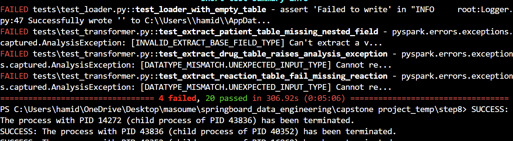
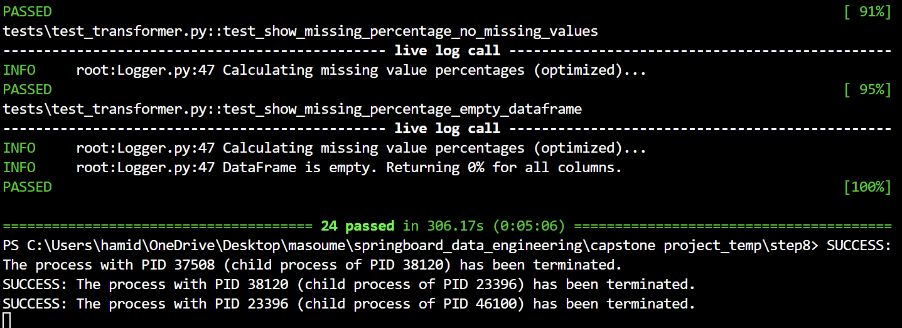
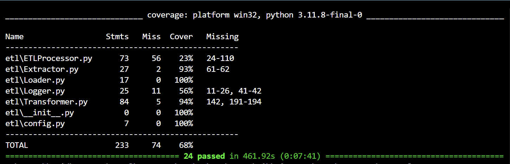

# ETL Pipeline Project — Step 8: Testing & Deployment to Azure Test Environment

## Overview

In this step, unit tests are written and executed locally to validate the ETL pipeline code before production deployment.
Although the deployment to Azure is covered in earlier steps, this phase ensures the code is robust and production-ready by simulating logic, edge cases, and validating pipeline stability through local testing.

This involves:

- Writing and running a robust suite of unit tests  
- Handling edge cases and validating pipeline stability  
- Measuring and reporting unit test results and code coverage  
- Ensuring compatibility with Azure services (e.g., Blob Storage, Spark) through mocks and local Spark sessions

---

## Objectives

- Ensure all components (Extractor, Transformer, Loader) function correctly in Azure’s environment  
- Design and implement comprehensive unit tests covering most of logic paths and edge cases  
- Achieve high test pass rates and strong code coverage  
- Confirm the pipeline can process datasets efficiently using Spark on Azure

---

## Project Setup and Structure

- ETL code modules located in `etl/`  
- Unit tests located in `tests/`  
- Azure Blob Storage read/write operations are mocked to simulate cloud interaction during unit testing. 
- PySpark used for data processing and handling JSON/parquet I/O

---

## Unit Testing

- Tests written using `pytest` framework  
- Tests validate each ETL component’s functionality including success/failure cases and edge scenarios  
- Tests utilize PySpark local sessions for lightweight execution on developer machines and CI pipelines  
- Mock objects and fixtures simulate Azure Blob configs and sample datasets  

---

## Running Tests Locally

```bash
pytest --cov=etl --cov-report=term-missing -v tests/
```
- Runs all tests in tests/
- Reports detailed code coverage of the etl/ modules
- Displays pass/fail statistics and uncovered lines

## Test Results

### Pre-Fix Execution Result


### Post-Fix Execution Result


### Code coverage

